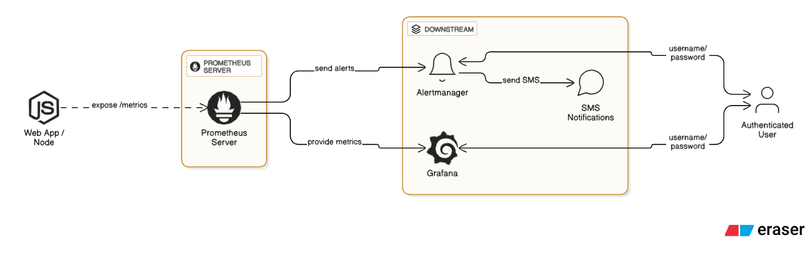
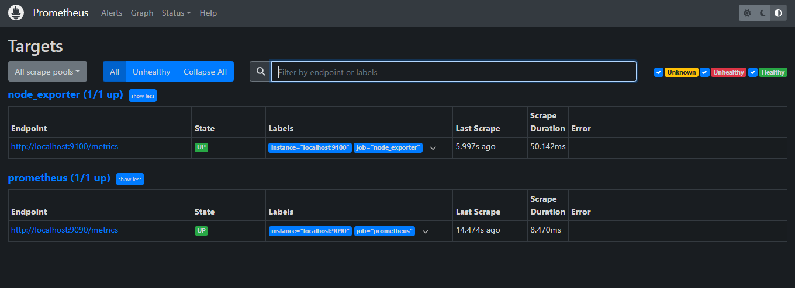
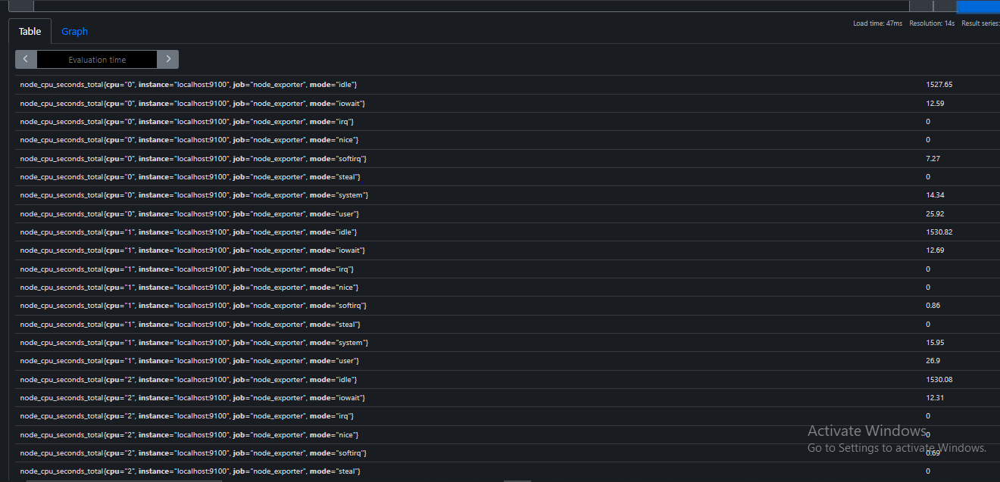
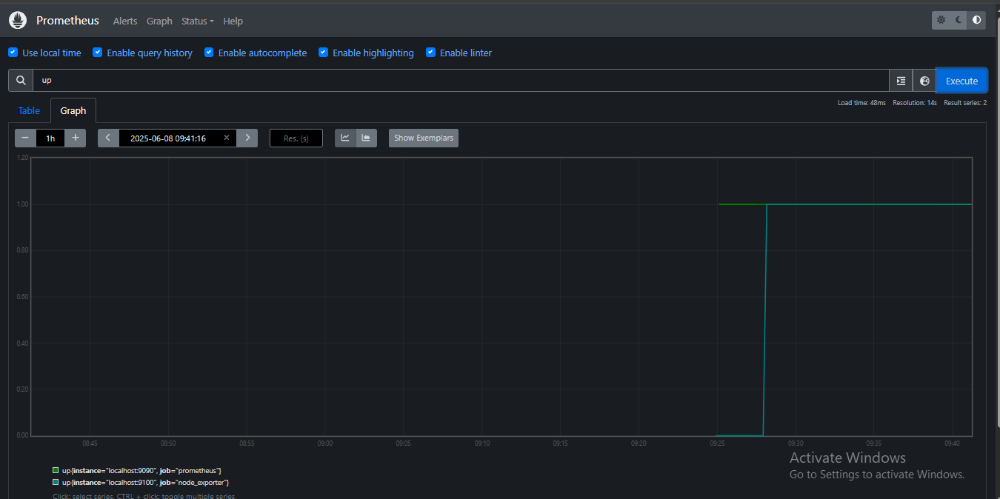
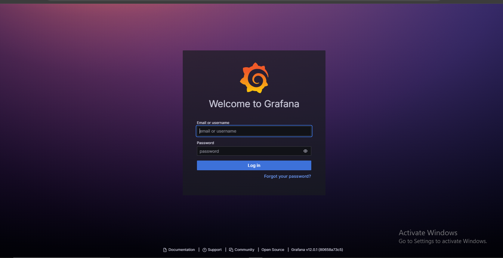
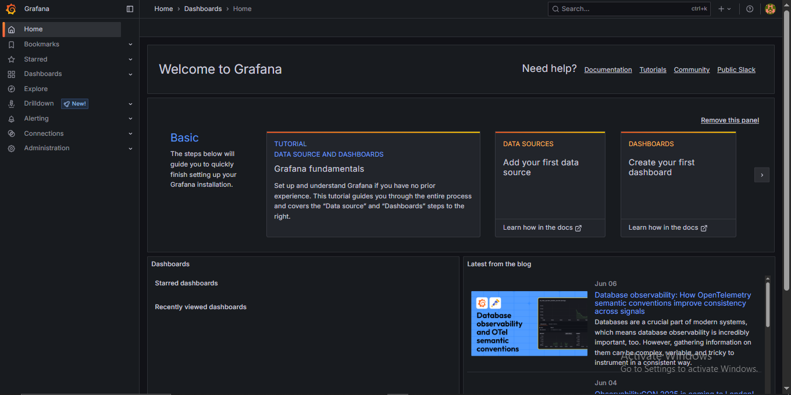
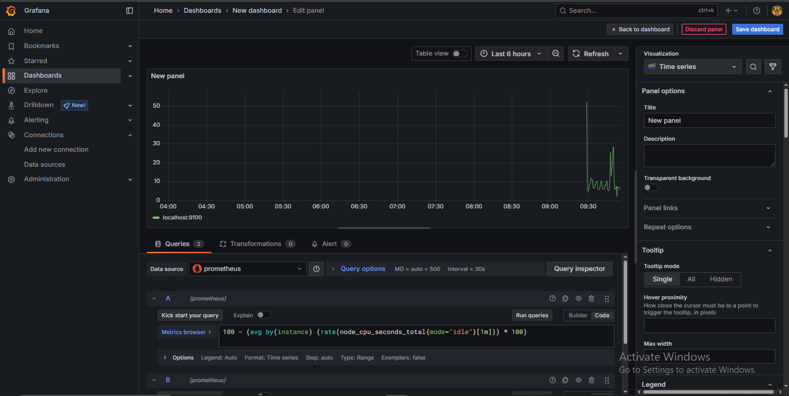

# 🖥️ Real-Time Linux System Monitoring with Prometheus & Grafana

This project demonstrates a comprehensive, real-time system monitoring solution for a Linux machine using **Prometheus**, **Node Exporter**, and **Grafana**. It provides a detailed, visually appealing dashboard to track key performance indicators (KPIs) like CPU, memory, disk, and network usage.

---
## 🛠️ Tech Stack

-   **Monitoring & Alerting:** Prometheus
-   **Metrics Exposition:** Node Exporter
-   **Visualization & Dashboards:** Grafana
-   **Query Language:** PromQL
-   **Core Technologies:** Linux Shell, YAML

---
## 🧱 Architecture Overview

The monitoring stack follows a simple yet powerful architecture. The **Node Exporter** runs on the target Linux machine, collecting system metrics. **Prometheus** is configured to periodically "scrape" (pull) these metrics from the Node Exporter and store them in its time-series database. Finally, **Grafana** connects to Prometheus as a data source to query and visualize the metrics in customizable dashboards.



---
## ✨ Project Showcase & Visual Guide

This visual walkthrough highlights the key components of the project, from the running services to the final dashboards.

### **1. Services Up & Running**
After setup, both Node Exporter and Prometheus run as services, exposing metrics and a query UI.

| Node Exporter (`:9100`)                                                     | Prometheus UI (`:9090`)                                                     |
| --------------------------------------------------------------------------- | --------------------------------------------------------------------------- |
|  |  |

### **2. Prometheus Targets**
Prometheus is configured to scrape metrics from itself and the Node Exporter. The "Targets" page confirms that both endpoints are `UP` and healthy.



### **3. Querying with PromQL**
Prometheus's UI allows for direct querying using PromQL. Here, we can inspect raw metrics like `node_cpu_seconds_total` and view them in a simple graph.

| Raw Metric Data                                                    | Simple `up` Graph                                      |
| ------------------------------------------------------------------ | ------------------------------------------------------ |
|  |  |

### **4. The Grafana Dashboard**
The real power of the stack is realized in Grafana, which turns the raw time-series data into insightful visualizations.

**Logging into Grafana (`:3000`)**


**The Main Dashboard View**
This custom dashboard provides a comprehensive overview of the system's health at a glance.


**Detailed Panels**
Each panel can be customized to show specific metrics, such as detailed CPU usage per core.
| Overall CPU Usage                                                        | Per-Core CPU Usage                                               |
| ------------------------------------------------------------------------ | ---------------------------------------------------------------- |
|  | .PNG) |

---
## 🚀 Setup Instructions

1.  **Download Prometheus & Node Exporter:**
    -   Get the latest Linux `amd64` versions from the [Prometheus downloads page](https://prometheus.io/download/).

2.  **Install and Run Node Exporter:**
    ```bash
    tar -xvf node_exporter-*.tar.gz
    cd node_exporter-*
    ./node_exporter &
    ```
    Verify it's running by visiting `http://localhost:9100/metrics`.

3.  **Configure and Run Prometheus:**
    -   Create a `prometheus.yml` file with the following configuration:
        ```yaml
        global:
          scrape_interval: 15s

        scrape_configs:
          - job_name: 'node_exporter'
            static_configs:
              - targets: ['localhost:9100']
        ```
    -   Start Prometheus:
        ```bash
        tar -xvf prometheus-*.tar.gz
        cd prometheus-*
        ./prometheus --config.file=prometheus.yml &
        ```
    Verify it's running by visiting `http://localhost:9090`.

4.  **Install and Run Grafana:**
    ```bash
    # Follow the official guide to install Grafana for your Linux distribution
    sudo systemctl start grafana-server
    sudo systemctl enable grafana-server
    ```
    Access Grafana at `http://localhost:3000` (default login: `admin` / `admin`).

5.  **Connect Grafana to Prometheus:**
    -   In Grafana, go to **Configuration > Data Sources > Add data source**.
    -   Select **Prometheus**.
    -   Set the URL to `http://localhost:9090`.
    -   Click **Save & Test**.

6.  **Build a Dashboard:**
    -   Go to **Dashboards > New dashboard > Add a new panel**.
    -   Select Prometheus as the data source and use PromQL queries (like `rate(node_cpu_seconds_total{mode="idle"}[1m])`) to build visualizations.

---
## 👨‍💻 Author

**Aryan Sharma**
-   **B.Tech CSE (AI & DS)** | Poornima University
-   **Location:** Jaipur, Rajasthan, India
-   **GitHub:** [@AryanSharma2206](https://github.com/AryanSharma2206)
-   **LinkedIn:** [linkedin.com/in/aryan-sharma-a2a240353](https://www.linkedin.com/in/aryan-sharma-a2a240353)
